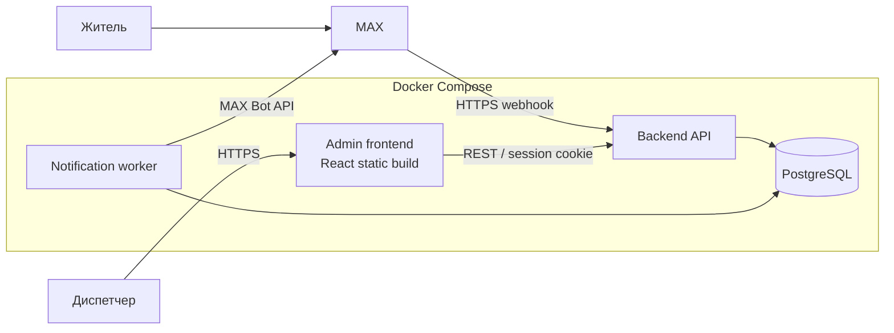
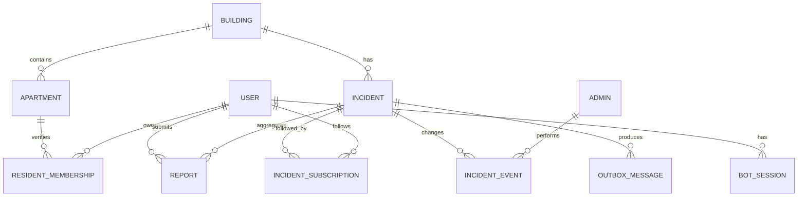

# Архитектура MVP «Умный дом в MAX»

## 1. Цель продукта

Житель сообщает о проблеме в доме через чат-бота MAX. Система предлагает уже открытые похожие инциденты, чтобы пользователь мог присоединиться к существующему случаю вместо создания дубля. Диспетчер обрабатывает один общий инцидент, а все подписанные жители получают обновления статуса.

Главная продуктовая метрика MVP: доля обращений, присоединённых к существующему инциденту без ручного объединения диспетчером.

Вспомогательные метрики:

- медианное время подачи обращения;
- количество дублей на один инцидент;
- время от первого обращения до принятия в работу;
- доля жителей, подтвердивших устранение проблемы.

## 2. Границы MVP

### Must Have

- онбординг жителя и привязка к дому/квартире по демонстрационному коду;
- создание обращения через пошаговый диалог в MAX;
- выбор категории, зоны дома, текстового описания и необязательной фотографии;
- показ кандидатов на совпадение и кнопка «Это та же проблема»;
- создание нового инцидента или присоединение к существующему;
- подписка жителя на изменения инцидента;
- таблица и карточка инцидента для диспетчера;
- смена статуса, срока и комментария диспетчера;
- уведомления подписчиков;
- история изменений;
- Docker Compose, миграции, seed-данные и README.

### Should Have

- ручное объединение двух инцидентов диспетчером;
- подтверждение жителями результата после статуса `resolved`;
- фильтры и поиск в админке;
- повторная отправка неудачных уведомлений;
- базовые продуктовые метрики.

### Could Have

- полнотекстовый поиск похожих описаний;
- карта/план дома;
- SLA и автоматическая эскалация;
- несколько управляющих организаций;
- аналитическая панель.

### Won't Have в MVP

- LLM для автоматической классификации;
- интеграция с ГИС ЖКХ и реальными биллинговыми системами;
- мобильное приложение вне MAX;
- микросервисная архитектура;
- автоматическое объединение по одному лишь сходству текста.

## 3. Архитектурный подход

Используется модульный монолит на Node.js + TypeScript. Это один репозиторий и один backend-образ, но код разделён на предметные модули. Фоновый worker запускается отдельным процессом из того же образа и обрабатывает надёжную очередь уведомлений.



Компоненты:

- `backend`: webhook MAX, REST API, бизнес-правила и авторизация;
- `worker`: отправка уведомлений из transactional outbox, тот же код и образ, другая команда запуска;
- `admin-web`: React + Vite, production-сборка раздаётся nginx;
- `postgres`: основная БД;
- reverse proxy/HTTPS: инфраструктура площадки или отдельный nginx/Caddy на сервере.

Redis, брокер сообщений и объектное хранилище для MVP не нужны. Для фотографии достаточно хранить идентификатор вложения MAX и необходимые метаданные. Если API MAX не позволяет повторно получить файл, подключается S3-совместимое хранилище как отдельное расширение.

## 4. Структура репозитория

```text
smart-home/
├── apps/
│   ├── backend/
│   │   ├── src/
│   │   │   ├── bot/              # webhook, FSM и адаптер MAX
│   │   │   ├── incidents/        # инциденты и matching
│   │   │   ├── routes/           # REST API и health endpoints
│   │   │   ├── auth/             # сессии, роли, пароли и аудит
│   │   │   ├── users/            # жители, дома и квартиры
│   │   │   └── shared/           # config, errors, logging, db
│   │   ├── prisma/
│   │   │   ├── schema.prisma
│   │   │   ├── migrations/
│   │   │   └── seed.ts
│   │   ├── tests/
│   │   └── Dockerfile
│   └── admin-web/
│       ├── src/
│       ├── nginx.conf
│       └── Dockerfile
├── docs/
│   ├── openapi.yaml
│   ├── DEPLOY_VDS.md
│   ├── OPERATIONS.md
│   └── DEMO_SCRIPT.md
├── compose.yaml
├── compose.demo.yaml
├── compose.production.yaml
├── .env.example
└── README.md
```

Фактический стек:

- Node.js 22, TypeScript;
- Express 5;
- Prisma + PostgreSQL 16;
- Zod для проверки входных данных;
- React + Vite;
- Vitest и Supertest;
- Pino для структурированных логов.

## 5. Предметная модель

Ключевое изменение относительно исходной схемы: `incident` — сама общая проблема, а `report` — конкретное сообщение жителя. Диспетчер управляет инцидентом, а не группой дублирующихся заявок.



### Основные таблицы

#### `users`

- `id UUID PK`;
- `max_user_id TEXT UNIQUE NOT NULL`;
- `display_name TEXT NULL`;
- `created_at TIMESTAMPTZ NOT NULL`;
- `deleted_at TIMESTAMPTZ NULL`.

#### `buildings` и `apartments`

- адрес хранится в `buildings`;
- квартира уникальна в пределах дома;
- индивидуальный `invite_code_hash` позволяет дополнительно подтвердить привязку к конкретной квартире без хранения открытого кода; если код не задан диспетчером, используется только демонстрационный общий код УК;
- связь пользователя с квартирой находится в `resident_memberships`, чтобы поддержать смену или несколько объектов.

#### `incidents`

- `id UUID PK`;
- `building_id UUID NOT NULL`;
- `category incident_category NOT NULL`;
- `location_zone TEXT NOT NULL` — например, `entrance:2`, `elevator:1`, `yard`;
- `title TEXT NOT NULL`;
- `status incident_status NOT NULL`;
- `priority incident_priority NOT NULL DEFAULT 'normal'`;
- `assignee_admin_id UUID NULL`;
- `due_at TIMESTAMPTZ NULL`;
- `delay_reason TEXT NULL`;
- `resolved_at TIMESTAMPTZ NULL`;
- `version INTEGER NOT NULL DEFAULT 1` для optimistic locking;
- `created_at`, `updated_at TIMESTAMPTZ NOT NULL`.

Статусы: `new`, `acknowledged`, `in_progress`, `resolved`, `rejected`.

Перенос срока не является отдельным статусом: инцидент остаётся в работе, а причина и новый срок записываются отдельно.

#### `reports`

- `id UUID PK`;
- `incident_id UUID NOT NULL`;
- `author_user_id UUID NOT NULL`;
- `apartment_id UUID NULL`;
- `description TEXT NOT NULL`;
- `max_attachment_id TEXT NULL`;
- `created_at TIMESTAMPTZ NOT NULL`;
- уникальность `(incident_id, author_user_id)` защищает от повторного присоединения.

#### `incident_subscriptions`

- `(incident_id, user_id)` — составной первичный ключ;
- `enabled BOOLEAN NOT NULL DEFAULT true`;
- `created_at TIMESTAMPTZ NOT NULL`.

#### `incident_events`

Append-only журнал: создание, присоединение, смена статуса, назначение, перенос срока, объединение и комментарий. Содержит инициатора, старые/новые значения и время.

#### `bot_sessions`

Состояние короткого диалога: шаг, временные ответы и `expires_at`. Сессия удаляется после завершения или истечения TTL.

#### `outbox_messages`

Событие уведомления создаётся в той же транзакции, что и изменение инцидента. Worker атомарно переводит ожидающее сообщение в `processing`, отправляет его и сохраняет число попыток, время следующей попытки и последнюю ошибку. Это защита от параллельной обработки, но не распределённая exactly-once доставка.

### Ограничения и индексы

- внешние ключи обязательны везде, где связь не может отсутствовать;
- `CHECK` на непустые описания и корректность `due_at`;
- индексы на `(building_id, status, updated_at DESC)` и `(building_id, category, location_zone, status)`;
- индекс на неотправленные `outbox_messages(next_attempt_at)`;
- все даты — `TIMESTAMPTZ`;
- инциденты архивируются; администратор может физически удалить квартиру вместе с её профилем и привязками, при этом исторические обращения сохраняются без номера квартиры;
- миграции запускаются отдельной командой до старта приложения.

## 6. Алгоритм поиска совпадений

В MVP нельзя автоматически склеивать обращения только по категории и времени. Ошибочное объединение хуже, чем дополнительный инцидент.

1. После выбора категории и зоны backend ищет активные инциденты того же дома.
2. Жёсткие фильтры: одинаковые `building_id`, `category`, `location_zone`; статус не `resolved/rejected`; обновление не старше настраиваемого окна, например 24 часов.
3. Кандидаты ранжируются по времени обновления; полнотекстовое сходство описаний не реализовано в MVP.
4. Бот показывает максимум три понятные карточки: описание, зона, время, число подтвердивших жителей.
5. Пользователь явно выбирает «Это та же проблема» либо «Создать новую».
6. При присоединении backend в одной транзакции создаёт `report`, подписку и событие аудита.

Повторная доставка одного webhook не создаёт вторую запись благодаря `processed_updates`. Полностью автоматическое объединение не допускается: житель явно выбирает совпадение.

## 7. Пользовательские сценарии

### Житель сообщает о проблеме

1. `/start` и согласие на обработку минимального набора данных.
2. Выбор дома/ввод демонстрационного кода квартиры.
3. «Сообщить о проблеме».
4. Выбор категории и зоны.
5. Краткое описание и необязательная фотография.
6. Просмотр похожих активных инцидентов.
7. Присоединение или создание нового.
8. Подтверждение с номером инцидента и текущим статусом.

На каждом шаге есть «Назад» и «Отмена». Повторная доставка одного webhook не создаёт вторую запись.

### Диспетчер обрабатывает инцидент

1. Входит в админку.
2. Видит очередь с фильтрами по дому, категории, статусу и сроку.
3. Открывает карточку: все обращения, фото, количество жителей и история.
4. Назначает ответственного, статус, срок и публичный комментарий.
5. Изменение атомарно записывается вместе с событием уведомления.
6. Worker уведомляет подписчиков, не раскрывая квартиры другим жителям.

### Закрытие

1. Диспетчер ставит `resolved` и добавляет комментарий.
2. Жители получают уведомление и кнопки «Устранено» / «Проблема осталась».
3. Отрицательное подтверждение возвращает инцидент диспетчеру на проверку, но не меняет статус автоматически без правила продукта.

## 8. API

### Публичные технические endpoints

- `POST /webhooks/max/:secret` — приём событий MAX;
- `GET /health/live` — процесс работает;
- `GET /health/ready` — приложение готово и БД доступна.

Секрет в URL — дополнительная защита от случайного трафика, а не замена проверке подлинности события, если MAX предоставляет подпись или иной механизм проверки.

### Авторизация администратора

- `POST /api/admin/session`;
- `DELETE /api/admin/session`;
- secure HttpOnly SameSite-cookie;
- роли `dispatcher` и `supervisor`;
- пароли хешируются `scrypt` с индивидуальной солью;
- rate limit на вход и временная блокировка после серии ошибок.

### Инциденты

- `GET /api/incidents`;
- `GET /api/incidents/:id`;
- `PATCH /api/incidents/:id` с обязательным `version`;
- `POST /api/incidents/:id/merge` — только supervisor;
- `GET /api/incidents/:id/events`.

Все входные DTO проверяются Zod. Ошибки имеют единый формат с `code`, `message`, `requestId` и `details` без внутренних stack trace.

## 9. Надёжность и безопасность

- секреты передаются только через environment/secrets и отсутствуют в Git;
- webhook и административные команды идемпотентны;
- административные изменения используют optimistic locking;
- уведомления отправляются через outbox с экспоненциальным backoff;
- токены, webhook-секреты и cookies маскируются в HTTP-логах; в fake-режиме текст тестовых сообщений попадает в лог, поэтому этот режим нельзя использовать с реальными персональными данными;
- административные действия пишутся в audit log;
- CORS разрешает только домен админки;
- используются security headers, ограничение размера JSON/файлов и rate limiting;
- пользователь видит и может отключить подписки; предусмотрено удаление/обезличивание профиля;
- номера квартир показываются в комментариях к общим заявкам и сообщениях между квартирами только жителям того же дома; личные заявки квартиры недоступны соседям;
- регулярный backup PostgreSQL описан в README, восстановление проверяется перед финалом.

## 10. Docker Compose и запуск

Production Compose содержит `db`, `backend`, `worker` и `admin-web`.

- `admin-web` собирается multi-stage Dockerfile и раздаётся nginx;
- `backend` запускает скомпилированный JavaScript, не dev-server;
- `worker` использует тот же image, но команду `node dist/worker.js`;
- `db` имеет volume и healthcheck;
- backend/worker стартуют после успешного healthcheck и выполненных миграций;
- наружу публикуется только web/reverse-proxy порт, PostgreSQL остаётся во внутренней сети;
- образы запускаются не от root и имеют healthcheck;
- `.env.example` содержит только названия и безопасные примеры, без рабочих секретов.

## 11. Наблюдаемость

Минимальный набор:

- `requestId` для каждого HTTP-запроса и webhook;
- счётчики созданных инцидентов, присоединений и ошибок уведомлений;
- длительность API-запросов;
- очередь/возраст неотправленных outbox-событий;
- журнал административных действий;
- отдельная команда диагностики подключения к БД и MAX API.

## 12. Критерии готовности MVP

MVP считается готовым, когда с чистой машины выполняется следующий сценарий:

1. `docker compose up --build` поднимает систему по README.
2. Seed создаёт дом, квартиры и учётную запись диспетчера.
3. Первый тестовый житель создаёт инцидент через MAX.
4. Второй видит его как похожий и присоединяется.
5. В админке отображается один инцидент и два обращения.
6. Диспетчер меняет статус и комментарий.
7. Оба жителя получают уведомление; при сбое после внешней отправки допускается повторная доставка, так как очередь имеет семантику «как минимум один раз».
8. После перезапуска контейнеров данные сохраняются.
9. Повторная доставка webhook не создаёт дубль.
10. Автоматические тесты основного сценария проходят.
